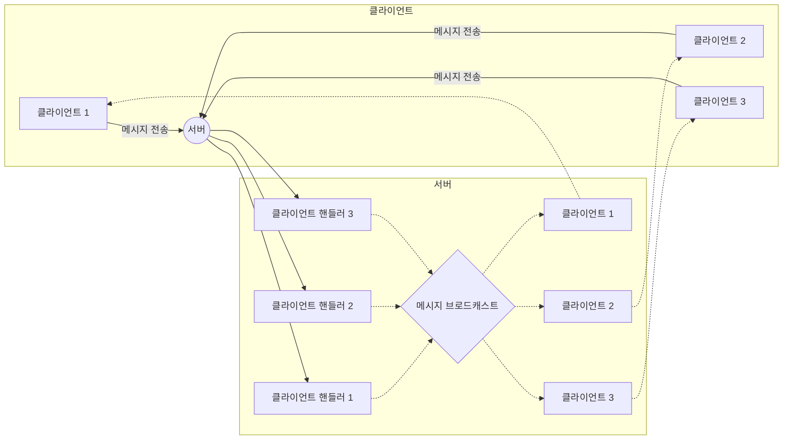

# MultiTreadChat
멀티쓰레드 기반의 채팅 시스템

```mermaid
graph LR
    subgraph 클라이언트
    A[클라이언트 1] -- 메시지 전송 --> B((서버))
    C[클라이언트 2] -- 메시지 전송 --> B
    D[클라이언트 3] -- 메시지 전송 --> B
    end

    subgraph 서버
    B --> E[클라이언트 핸들러 1]
    B --> F[클라이언트 핸들러 2]
    B --> G[클라이언트 핸들러 3]

    E -.-> H{메시지 브로드캐스트}
    F -.-> H
    G -.-> H

    H -.-> I[클라이언트 1]
    H -.-> J[클라이언트 2]
    H -.-> K[클라이언트 3]
    end

    I -.-> A
    J -.-> C
    K -.-> D

    click E " " "Thread 1"
    click F " " "Thread 2"
    click G " " "Thread 3"

```
