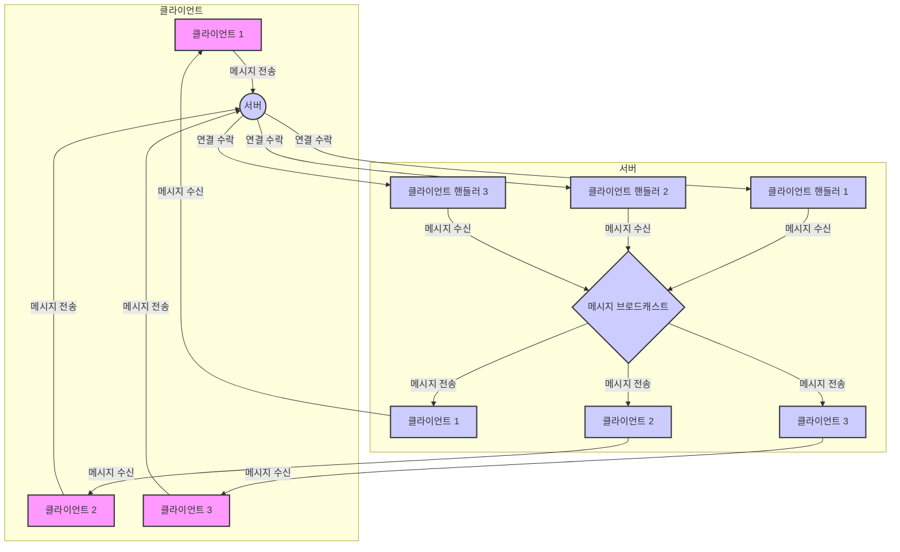

# MultiTreadChat
멀티쓰레드 기반의 채팅 시스템

### 멀티쓰레드란?
- 하나의 프로세스를 다수의 실행 단위로 구분하여 자원을 공유하고 자원의 생성과 관리의 중복성을 최소화하여 수행 능력을 향상시키는 것을 멀티쓰레딩이라고 한다.
- 하나의 프로그램에 동시에 여러개의 일을 수행할수 있도록 해주는 것이다.

```mermaid
graph TD
    subgraph 클라이언트
    A[클라이언트 1] -->|메시지 전송| B
    C[클라이언트 2] -->|메시지 전송| B
    D[클라이언트 3] -->|메시지 전송| B
    end

    subgraph 서버
    B((서버)) -->|연결 수락| E[클라이언트 핸들러 1]
    B -->|연결 수락| F[클라이언트 핸들러 2]
    B -->|연결 수락| G[클라이언트 핸들러 3]

    E -->|메시지 수신| H{메시지 브로드캐스트}
    F -->|메시지 수신| H
    G -->|메시지 수신| H

    H -->|메시지 전송| I[클라이언트 1]
    H -->|메시지 전송| J[클라이언트 2]
    H -->|메시지 전송| K[클라이언트 3]
    end

    I -->|메시지 수신| A
    J -->|메시지 수신| C
    K -->|메시지 수신| D

    classDef 클라이언트 fill:#f9f,stroke:#333,stroke-width:2px;
    classDef 서버 fill:#ccf,stroke:#333,stroke-width:2px;
    class A,C,D 클라이언트;
    class B,E,F,G,H,I,J,K 서버;
```
