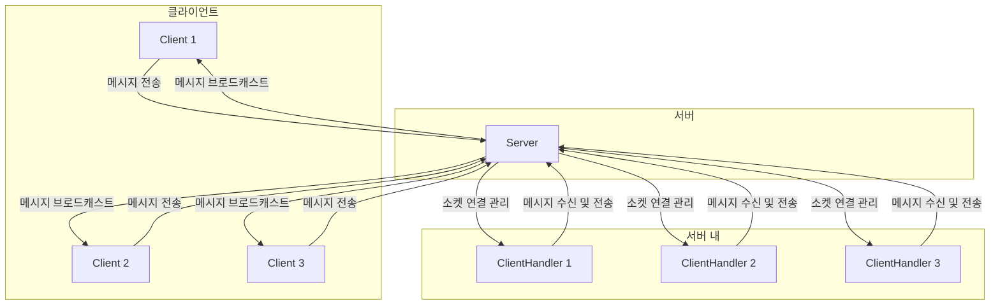

# MultiTreadChat
멀티쓰레드 기반의 채팅 시스템

## 개요
MultiTreadChat은 멀티쓰레드와 소켓 통신을 활용한 채팅 시스템입니다. 서버는 각 클라이언트의 연결을 독립적인 스레드로 처리하여 동시에 여러 사용자가 원활하게 채팅할 수 있도록 합니다. GUI는 JavaFX를 활용했습니다. 해당 프로젝트를 이용하시려면 JavaFX에 대한 의존성 추가가 필요합니다. 21버전 SDK를 받아 `lib` 주소를 library에 넣어주세요.

추가로 클라이언트 run 구성에서 VM 옵션으로 해당 코드를 넣어주세요:

```
--module-path C:\javafx-sdk-21.0.3/lib --add-modules javafx.controls,javafx.fxml
```

위의 경로는 JavaFX SDK를 저장한 위치에 따라 다를 수 있습니다. 저는 C 드라이브 바로 아래에 저장했습니다.

## 목차
1. [멀티쓰레드란?](#멀티쓰레드란)
2. [프로세스와 쓰레드](#프로세스와-쓰레드)
3. [멀티쓰레드의 장점](#멀티쓰레드의-장점)
4. [멀티쓰레드 통신 방식](#멀티쓰레드-통신-방식)
5. [소켓 통신](#소켓-통신)
6. [Java에서의 스레드 관리](#Java에서의-스레드-관리)
7. [Client와 Server의 구조](#Client와-Server의-구조)
8. [실행 방법](#실행-방법)

## 멀티쓰레드란?
- 하나의 프로세스를 다수의 실행 단위로 구분하여 자원을 공유하고 자원의 생성과 관리의 중복성을 최소화하여 수행 능력을 향상시키는 것을 멀티쓰레딩이라고 합니다.
- 하나의 프로그램에서 동시에 여러 작업을 수행할 수 있도록 합니다.

## 프로세스와 쓰레드
### 프로세스
- **정의**: 실행 중인 프로그램의 인스턴스
- **특징**:
  - **독립성**: 각 프로세스는 별도의 메모리 공간을 가집니다.
  - **자원 할당 단위**: CPU 시간, 메모리, 파일 핸들 등 자원을 할당받습니다.
  - **고립성**: 한 프로세스의 문제는 다른 프로세스에 영향을 미치지 않습니다.
- **예**: 웹 브라우저, 텍스트 편집기

### 쓰레드
- **정의**: 프로세스 내에서 실행되는 작은 실행 단위
- **특징**:
  - **경량성**: 적은 자원으로 생성 및 관리
  - **자원 공유**: 같은 프로세스 내에서 메모리와 자원을 공유
  - **병행 실행**: 여러 스레드가 동시에 실행 가능
  - **협력적 작업**: 여러 스레드가 협력하여 작업을 효율적으로 수행
- **예**: 웹 브라우저의 탭, 워드 프로세서의 자동 저장 기능

## 멀티쓰레드의 장점
- **자원 절약**: 메모리와 시스템 자원 소모 감소
- **간단한 통신**: 전역 변수나 힙을 이용해 데이터를 주고받을 수 있어 통신이 간단
- **빠른 문맥 교환**: 프로세스보다 빠른 문맥 교환
- **응답 시간 단축**: 시스템 처리량 증가 및 자원 소모 감소로 응답 시간 단축

## 멀티쓰레드 통신 방식
### 클라이언트 연결 관리
- 서버는 클라이언트의 연결 요청을 수락하고, 각 연결에 대해 새로운 스레드를 생성
- 각 스레드는 해당 클라이언트와의 통신을 독립적으로 처리

### 소켓을 통한 통신
- 각 스레드는 소켓을 사용해 클라이언트와 데이터를 주고받음
- 서버는 모든 클라이언트 스레드 간에 공유되는 자원을 관리

### 문맥 교환의 효율성
- 스레드 간의 문맥 교환이 프로세스 간 문맥 교환보다 빠름
- 시스템의 처리량 향상 및 자원 소모 감소

## 소켓 통신
- **정의**: 두 네트워크 장치 간의 데이터 교환을 가능하게 하는 소프트웨어 구조
- **통신 방식**: 주로 TCP와 UDP를 통해 통신
- **프로젝트에서 사용한 방식**: Java의 `ServerSocket`과 `Socket` 클래스를 사용한 TCP 통신

### 예시 코드
```java
// 서버 코드 예시
ServerSocket serverSocket = new ServerSocket(8000);
while (true) {
    Socket clientSocket = serverSocket.accept();
    new Thread(new ClientHandler(clientSocket)).start();
}
```

## Java에서의 스레드 관리
- 스레드 생성: `new Thread(() -> { ... }).start();`
- 비동기 작업: `Runnable` 인터페이스를 구현하여 비동기 작업 수행
- 문맥 교환: 운영 체제에 의해 스레드 간 문맥 교환이 효율적으로 관리

## Client와 Server의 구조



## 실행 방법
1. JavaFX SDK를 다운로드하고 `lib` 폴더의 경로를 환경 변수에 추가합니다.
2. 클라이언트 실행 시 VM 옵션에 다음 코드를 추가합니다:
   ```
   --module-path C:\javafx-sdk-21.0.3/lib --add-modules javafx.controls,javafx.fxml
   ```
3. 서버를 실행합니다:
   ```shell
   java -cp . server.Server
   ```
4. 클라이언트를 실행합니다:
   ```shell
   java -cp . client.Main
   ```
5. 여러 클라이언트를 실행하여 채팅 시스템을 테스트합니다.

이 README 파일을 통해 프로젝트의 전체적인 개요와 구조, 실행 방법을 쉽게 이해할 수 있을 것입니다. 추가로 필요한 사항이 있으면 알려주세요.
