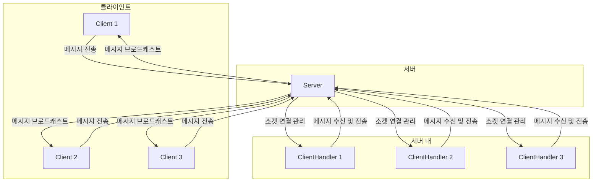

# MultiTreadChat
멀티쓰레드 기반의 채팅 시스템

### 멀티쓰레드란?
- 하나의 프로세스를 다수의 실행 단위로 구분하여 자원을 공유하고 자원의 생성과 관리의 중복성을 최소화하여 수행 능력을 향상시키는 것을 멀티쓰레딩이라고 한다.
- 하나의 프로그램에 동시에 여러개의 일을 수행할수 있도록 해주는 것이다.

##### 프로세스와 쓰레드

프로세스
- 프로세스는 실행 중인 프로그램의 인스턴스입니다.
- 운영 체제에서 프로그램이 실행될 때, 프로그램 코드는 프로세스로 로드되며, 이는 필요한 자원(메모리, 파일 핸들 등)을 할당받아 작업을 수행합니다.

- **특징**:
  - **독립성**: 각 프로세스는 별도의 메모리 공간을 가지며, 다른 프로세스와 메모리를 공유하지 않습니다.
  - **자원 할당 단위**: 프로세스는 CPU 시간, 메모리, 파일 핸들 등 자원을 할당받습니다.
  - **고립성**: 한 프로세스에서 발생한 문제가 다른 프로세스에 영향을 미치지 않습니다.

- **예**: 웹 브라우저, 텍스트 편집기, 터미널 세션 등 각각의 실행 중인 애플리케이션은 독립적인 프로세스입니다.

스레드 (Thread)
스레드는 프로세스 내에서 실행되는 작은 실행 단위입니다. 하나의 프로세스는 여러 개의 스레드를 가질 수 있으며, 이들 스레드는 프로세스 내의 자원을 공유하면서 동시에 실행됩니다.

- **특징**:
  - **경량성**: 스레드는 프로세스보다 훨씬 가볍고 적은 자원으로 생성 및 관리됩니다.
  - **자원 공유**: 같은 프로세스 내의 스레드들은 메모리 공간과 자원을 공유합니다.
  - **병행 실행**: 여러 스레드는 병행하여 실행될 수 있으며, CPU의 멀티코어 기능을 활용하여 성능을 향상시킬 수 있습니다.
  - **협력적 작업**: 여러 스레드가 협력하여 하나의 작업을 보다 효율적으로 수행할 수 있습니다.

- **예**: 웹 브라우저의 탭, 워드 프로세서의 자동 저장 기능, 게임의 그래픽 렌더링과 물리 엔진 등이 각각 별도의 스레드로 실행될 수 있습니다.

> 크롬 브라우저의 경우 탭 하나 하나하나가 하나의 프로세스임

# 그렇다면 왜 멀티쓰레드로 구현을 하냐?

- 프로세스를 이용하여 동시에 처리하던 일을 쓰레드로 구현할 경우 메모리 공간과 시스템 자원 소모가 줄어들게 된다.

- 쓰레드 간의 통신이 필요한 경우에도 별도의 자원을 이용하는 것이 아니라 전역 변수의 공간 또는 동적으로 할당된 공간인 힙(Heap) 영역을 이용하여 데이터를 주고받을 수 있다.

- 그렇기 때문에 프로세스 간 통신 방법에 비해 쓰레드 간의 통신 방법이 훨씬 간단하다.

- 심지어 쓰레드의 문맥 교환은 프로세스 문맥 교환과는 달리 캐시 메모리를 비울 필요가 없기 때문에 더 빠르다.

- 따라서 시스템의 처리량이 향상되고 자원 소모가 줄어들어 자연스럽게 프로그램의 응답 시간이 단축된다.

- 이러한 장점 때문에 여러 프로세스로 할 수 있는 작업들을 하나의 프로세스에서 여러 쓰레드로 나눠 수행하는 것이다.

# 멀티쓰레드로 어떻게 통신 한다는거냐?

#### 클라이언트의 연결을 쓰레드로 관리

- 서버는 클라이언트의 연결 요청을 수락하고, 각 연결에 대해 새로운 스레드를 생성합니다.
- 각 스레드는 해당 클라이언트와의 통신을 전담하여 독립적으로 처리합니다.

#### 소켓을 통한 통신

- 각 스레드는 소켓을 사용하여 클라이언트와 데이터를 주고받습니다.
- 소켓 통신을 통해 클라이언트는 서버로 메시지를 전송하고, 서버는 이 메시지를 다른 클라이언트들에게 전달합니다.

#### 자원 공유

- 서버는 모든 클라이언트 스레드 간에 공유되는 자원(예: 메시지 큐, 클라이언트 목록)을 관리합니다.
- 이러한 공유 자원을 통해 스레드 간 통신이 가능하며, 메시지 전달이나 브로드캐스팅을 효과적으로 수행할 수 있습니다.

#### 문맥 교환의 효율성

- 스레드 간의 문맥 교환은 프로세스 간 문맥 교환보다 훨씬 빠릅니다. 이는 캐시 메모리를 비울 필요가 없기 때문입니다.
- 이러한 효율성 덕분에 시스템의 처리량이 향상되고 자원 소모가 줄어듭니다.

> Q. 문맥 교환은 언제 일어나는데?
> 
> A. 문맥 교환(Context Switching)은 운영 체제가 현재 실행 중인 프로세스나 스레드를 중지하고, 다른 프로세스나 스레드로 전환할 때 발생합니다.

# 소켓 통신? 그게 뭐야?

- 소켓 통신은 두 네트워크 장치 간의 데이터 교환을 가능하게 하는 소프트웨어 구조입니다. 소켓은 주로 TCP(Transmission Control Protocol)와 UDP(User Datagram Protocol)를 통해 통신합니다.

> Q. 해당 프로젝트에서는 어떤 통신 방식으로 구현했어?
>
> A. Java에서 제공하는 API를 활용했어!
> ServerSocket과 Socket 클래스 사용:
>
> ServerSocket과 Socket 클래스는 TCP 통신을 위한 자바 표준 클래스야. 이들은 TCP 연결을 설정하고 데이터 전송을 위한 스트림을 제공해!
> TCP는 신뢰성 있는 연결 기반 통신 프로토콜로, 데이터의 순서와 무결성을 보장하지
>
> ServerSocket과 Socket 클래스에 대해 설명해줄게.
> 
> 연결 지향적 통신:
> 코드에서 클라이언트와 서버는 연결을 설정한 후 지속적으로 데이터를 주고받아. 이는 TCP의 특성이야.
> ServerSocket.accept() 메소드는 클라이언트의 연결 요청을 받아들이고, Socket 객체를 반환해 이는 TCP 연결이 성공적으로 설정되었음을 의미해.
> 그리 메소드는 클라이언트의 연결 요청을 수락할 때까지 블록(block)되지
> 
> 스트림 기반 통신:
>
> 데이터 송수신을 위해 PrintWriter와 BufferedReader를 사용하고 있어. 이는 스트림 기반 통신 방식으로 TCP의 특성이야.
> PrintWriter는 데이터를 출력 스트림에 쓰고, BufferedReader는 입력 스트림에서 데이터를 읽어
> 

# 소켓통신으로 통신 한다는 건 알겠어. 그럼 이제 Tread단위로 통신을 주고 받는 다는 애기가 되겠네? 그렇다면 자바에서는 어떻게 Tread를 관리하는데?

